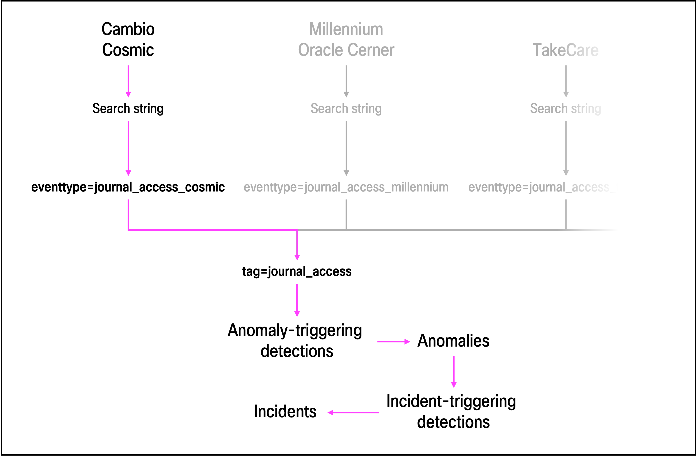

**Fields**

      - Example:
          - If working with Cambio COSMIC events, extract the field as cosmic_staff_ID and create an alias: cosmic_staff_ID AS staff_ID.

**Event types**

Event types allows for categorization of events in a journal system. By defining field-value pairs and search terms, you can identify specific
types of journal events and save it as an event type which then can be references in a search (for example, eventtype=journal_access_cosmic), simplifying searches and ensuring consistency. Since Splunk uses schema-on-read, event types can be easily modified and updated over time.

When multiple event types relate to the same category (for example, events from different journal systems that track who has viewed whose journal), you can assign them a common tag. This allows you to retrieve all relevant journal events in a single search by referencing a tag (for example, tag=journal_access), without manually specifying each event type.

For the use cases in this repository, each journal system is expected to have **two unique event types** that targets different event categories:
- journal_access_\<journalSystemName\>
  - this category include events that records employees accessing patient journals.
- journal_activity_\<journalSystemName\>
  - this category include events that records create/read/update/delete acitivities from employees in the journal system.

Event types can be created either through Splunk Web and Splunk configuration files. Which you choose depends on your preferences. Down below 
- Splunk Web (recommended):
   1. Navigate to **Settings > Event Types**
   2. Click on **New Event Type**
   3. In the **Name** field, enter a name for the event type.
     4. This name should be unique across all event types in Splunk
     5. 
   6. In the **Search string** field, enter:
   7. In the **Tag(s)** field, enter: 
  considerations: 
    - If you create an event type via Splunk Web and reference a tag that does not already exist, Splunk automatically creates that tag for you.
    - Adjust permissions to ensure that the appropriate roles in Splunk have read and/or write access to event types.
        
Each event type needs three pieces of information:
- A unique **name**
- A **search string** that identifies the relevant events from the specific journal system.
  - It's best practice to reference the index, host, source, and sourcetype fields associated with the specific journal system if possible. These fields are mandatory across all events in Splunk and provides important metadata about for example where it originated, what kind of data it contains, and what index it is located in.
  - Depending on the journal system, additional field-value pairs and search terms to narrow down the events to the desired event categorization.
  - Example: index=cosmic sourcetype=cosmic source=F_IX_ACCESSLOG staff_ID=* patient_ID=* 
- A reference to a **tag**
  - Example: journal_access

