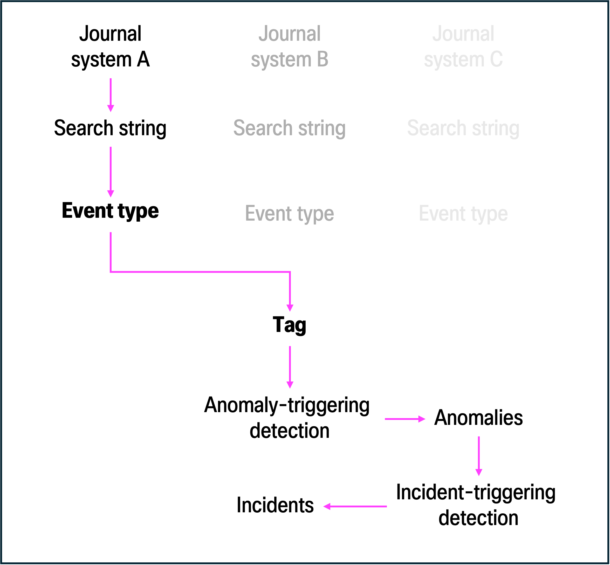

**fields**

      - Example:
          - If working with Cambio COSMIC events, extract the field as cosmic_staff_ID and create an alias: cosmic_staff_ID AS staff_ID.

**Event types**

An event type is a saved search that categorizes events within e.g. a journal system. By defining field-value pairs and search terms, you can identify specific types of journal events and reference them by name (e.g., eventtype=cosmic_journalaccess), simplifying searches and ensuring consistency. Since Splunk uses schema-on-read, event types can be easily modified and updated as journal system data evolves.

When multiple event types relate to the same category (e.g., logs from different journal systems tracking journal access), you can assign them a common tag. This allows you to retrieve all relevant journal events in a single search by referencing a tag (e.g., tag=journalaccess), without manually specifying each event type.

For the use cases in this repository, each journal system in your environment is expected to have its own unique event type. Additionally, all event types should reference the tag journal to ensure unified searchability across different journal data sources.

Event types can be created in two ways:
- Splunk Web (recommended): Settings > Event Types > New Event Type
  - If you create an event type via Splunk Web and reference a tag that does not already exist, Splunk automatically creates that tag for you.
  - Adjust permissions to ensure that the appropriate roles in Splunk have read and/or write access to event types.
- Configuration files (optional): eventtypes.conf and tags.conf.
  - If you define an event type in eventtypes.conf that references a tag that does not already exist, you must manually define that tag in tags.conf.
  - Adjust permissions to ensure that the appropriate roles in Splunk have read and/or write access to event types.
        
Each eventtype needs three pieces of information:
- A unique name
- A search string that identifies the relevant events from the specific journal system.
  - It's best practice to reference the index, host, source, and sourcetype fields associated with the journal system in question. These fields are mandatory across all events in Splunk and provides important metadata about where it originated, what kind of data it contains, and what index it is located in.
  - Depending on the journal system, additional field-value pairs and search terms to narrow down the events to the desired event categorization.
- A reference to the tag 'journalaccess'.

