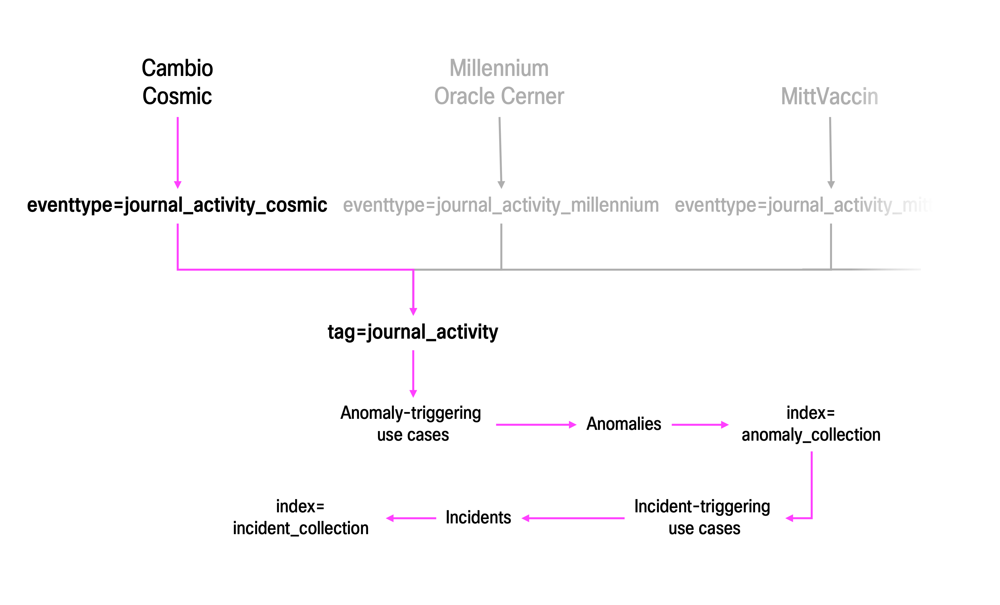

## **Introduction**
Welcome to this Data Onboarding Guide! This document is designed to help you get the right data into Splunk and ensure it is properly parsed, indexed, and normalized, making it fully compatible with the out-of-the-box use cases and dashboards included in this repository.

Rather than detailing configurations needed for every possible data source — which would be impractical due to the wide variety of data sources — this guide focuses on:
- Key steps in the data onboarding process
- Key Splunk concepts
- Best practices

By going through this guide, you should have that "**Aha! Now I get it**" moment where (almost) everything clicks and you feel confident getting started. If that doesn't happen, then contact the authors (or your friendly neighborhood Splunk Solutions Engineer) right away.

Observe! This guide does not remove the need for proper Splunk Education.
## Data sources

To establish deep insights into employee behaviour and proactively detect patient privacy violations, it is important to understand the key pieces of data needed. The use cases and dashboards in this repository rely on three critical **data categories**:

### **EHR Audit Data**
Provides detailed insights into the **who, what, and when**, within the Electronic Health Record (EHR) system. This includes log entries related to medical record access, modifications, and actions performed by user accounts. 

### **Identity Data**

This data provides context about employees, including:
1.	User-Account Mapping – Identifies which user accounts are linked to which employees.
2.	Work-Related Information – Includes details such as the employee’s role, care provider and work unit associations, employment status, and organization-issued ID.
3.	Personal Information – Covers personal details such as first and last name, home city, postal code, address, and government-issued ID.


### **Authentication Data**
Captures how and when employees authenticate to the system, including successful and failed login attempts, and multi-factor authentication events. This data helps identify suspicious access patterns, and most importantly, it acts as important evidence to secure accountability.

### **Considerations on Log Quality**
⚠️ **Important:** The reality is that the **quality of logs may differ** depending on the EHR application used. Some logs may provide almost all metadata needed,  while others may lack essential details. This variation can impact analytics and could possibly act as a show-stopper for certain use cases (the analytics can never be better than the data used for it)..

---


## Getting Data From EHR Applications Into Splunk

Splunk can collect, index, search, correlate, and visualize **any data from any application**, including logs from popular EHR systems such as Cambio, Cerner, and Epic.

When onboarding logs from a new application, it’s crucial to provide Splunk with the right instructions to ensure that each log entry is correctly processed. This involves two key stages:
1. Index-time processing – This begins when Splunk receives the logs. During this stage, Splunk breaks log entries into individual events, assigns each event a timestamp, and applies necessary transformations before storing them in an index.
2. Search-time processing – Once data is indexed, Splunk requires additional instructions to structure and normalize logs for analysis. This happens dynamically from the moment a search is initiated until it successfully completes.

To handle the wide variety of log formats—whether from different applications or variations within the same application—Splunk assigns each format a unique **sourcetype**. This ensures that index-time and search-time processing instructions are applied correctly, enabling accurate data ingestion and analysis.


### **What is a Sourcetype?**

A [sourcetype](https://docs.splunk.com/Splexicon:Sourcetype) is a classification label that holds a set of configurations which instructs Splunk how to handle index-time and search-time processing for a given data source.


### **How is a Sourcetype Created?**

The process of creating a sourcetype involves the following fundamental steps:
1. Familiarize yourself with the logs.
2. Define index-time processing for the sourcetype.
3. Define search-time processing for the sourcetype.
4. Validate the sourcetype.
5. Save the sourcetype.
6. Assign the sourcetype.
7. Validate the sourcetype.

#### **1. Familiarize yourself with the logs**

The first step is to understand what logs each application generates, where they are stored, and in what format. When analyzing the **log formats**, it is important to consider the following:

-  Are the logs **structured** (csv, json, xml), **unstructured** (free-text), or a combination❓ 
-  Does each log entry consist of a **single line** or **multiple lines**❓ 
-  What **delimiter** separates log entries (i.e, what indicates the end and start of a new log entry)❓ 
-  What **format** does the timestamp have that indicates the point in time when the log entry was generated by the application, and where is it positioned in the log entries❓

Additionally, it is essential to consider the **content of the logs** to determine whether they fall into different categories. Even within the same vendor, application, and module combination, multiple sources (e.g., two log files) may share the same log format but contain different content, and it thus make sense assign them to different categories. Proper categorization ensures that events can be easily filtered in Splunk, allowing users to efficiently find the desired subset of data.

Rule of thumb when determining if two sources should be assigned the same (or different) sourcetype:
| Vendor/Application/Module     | Log Format   | Category   | Sourcetype |
|----------------|----------|------------|------------|
| Same  | Different | Different  | Different  |
| Same  | Same      | Different  | Different  |
| Different | Same      | Same       | Different  |
| Same  | Same      | Same       | Same       |


#### **2. Index-time Processing: Understand Event Line-Breaking**

[Event line-breaking](https://docs.splunk.com/Documentation/Splunk/latest/Data/Configureeventlinebreaking) determines how Splunk processes raw text and breaks it into individual events, ensuring that every complete log entry is indexed as a separate event.

A full list of configurations for event line-breaking with detailed explanations can be found [here](https://docs.splunk.com/Documentation/Splunk/latest/Data/Configureeventlinebreaking#:~:text=Line%20breaking%20general,affect%20line%20breaking.). 
In many cases, the default settings are sufficient, so it’s recommended to test them first. If they don't do the job, then consider adjusting the following key settings (part of what is known as the [Splunk Great Eight](https://lantern.splunk.com/Splunk_Platform/Product_Tips/Data_Management/Configuring_new_source_types#:~:text=The%20Splunk%20Great%20Eight%0A(always%20configure%20for%20all%20source%20types))):

- `LINE_BREAKER` → Specifies a regex that determines how Splunk breaks raw text into lines. The regex must contain a capturing group, and wherever the regex matches, Splunk considers the start of the first capturing group to be the end of the previous line, and considers the end of the first capturing group to be the start of the next line. The portion of the text matched by the capturing group is excluded from the lines. Whether each line is directly processed as an individual event depends on if Splunk is instructed to try to merge lines or not (see SHOULD_LINEMERGE setting).
  - Default: LINE_BREAKER = ([\r\n]+)
- `SHOULD_LINEMERGE` → Specifies a boolean that determines whether Splunk should try to merge multiple lines into to a single event based on specific patterns. If set to false, each individual line will processed as a single event. If set to true, the default behavior is that Splunk will create a new event if it encounters a line that includes a timestamp (that is, the line with the timestamp will become part of the next event). Splunk encourages disabling line merging if you can do with just LINE_BREAKER, as it results in improved performance.
  - Default: SHOULD_LINEMERGE = true 
- `TRUNCATE` → Determines the maximum size of an event, in bytes. This prevents Splunk from indexing abnormally large events that can have negative impact on performance.
  - Default: TRUNCATE = 10000 

For example, to properly apply event line-breaking to free-text single-line logs delimited by a single \n character:  
```ini
LINE_BREAKER = ([\r\n]+)  # This is a default setting - breaks raw data into lines whenever one or more newlines are identified.
SHOULD_LINEMERGE = false # Because the log entries are single line only, line merging can be disabled.
TRUNCATE = 10000 # This is a default setting - sees to that an event cannot exceed 10,000 bytes in size. 
```

#### **3. Index-time Processing: Define Event Line Breaking**

#### **3. Index-time Processing: Understand Event Timestamp Assignment**

[Event timestamp assignment](https://docs.splunk.com/Documentation/Splunk/latest/Data/HowSplunkextractstimestamps) determines how Splunk identifies, extracts, and assigns a timestamp to each individual event.

A full list of configurations for event timestamp assignment with detailed explanations can be found [here](https://docs.splunk.com/Documentation/Splunk/9.4.0/Data/Configuretimestamprecognition#:~:text=of%20these%20settings.-,Timestamp%20settings,The%20following%20timestamp%20configuration%20settings%20are%20available%3A,-Setting). If you do not explicitly define event timestamp assignment for your sourcetype, Splunk will attempt to assign timestamps automatically. If this process fails, Splunk will use the time the event was indexed as its timestamp. However, relying on automatic timestamp assignment carries risks, so it is strongly recommended to define custom event timestamp configurations. To do this, consider the following key settings (part of what is known as the [Splunk Great Eight](https://lantern.splunk.com/Splunk_Platform/Product_Tips/Data_Management/Configuring_new_source_types#:~:text=The%20Splunk%20Great%20Eight%0A(always%20configure%20for%20all%20source%20types))):

- `TIME_PREFIX` → A regex that identifies where the timestamp begins in an event. The timestamp is expected to follow immediately after every match.
- `TIME_FORMAT` → Defines the expected timestamp format using a strftime-style pattern.
- `MAX_TIMESTAMP_LOOKAHEAD` → Specifies how many characters Splunk should scan after TIME_PREFIX to extract the timestamp.

For example, to properly apply event timestamp assignment to free-text single-line logs with timestamps in ISO 8601 format (including microseconds):
```ini
TIME_PREFIX = ^  # A regex indicating that the timestamp is located at the beginning of each log entry.
TIME_FORMAT = %Y-%m-%dT%H:%M:%S.%6QZ  # Strptime indicating that the timestamp format follow ISO 8601 with microseconds.
MAX_TIMESTAMP_LOOKAHEAD = 27  # Indicating that the timestamp length is up to 27 characters.
```

##### Define and Validate Index-time Processing

It is recommended to define and store a sourcetype in a Splunk [add-on](https://docs.splunk.com/Documentation/Splunk/latest/Admin/Whatsanapp#:~:text=a%20performance%20bottleneck.-,Add%2Don,specific%20capabilities%20to%20assist%20in%20gathering%2C%20normalizing%2C%20and%20enriching%20data%20sources.,-An%20add%2Don). In simple terms, an add-on is a folder for configurations (and sometimes scripts) that when brought into Splunk extends it with additional functionality. Although add-ons can serve a variety of purposes, a **Technical Add-on (TA)** is specifically designed to assist with collecting, parsing, and normalizing data from specific sources.

To create a 

It is recommended to run tests to validate that the index-time processing works as intended. This is easiest done via the "Add Data" wizard in Splunk Web.
1. Navigate to **Settings → Add Data** in Splunk Web.
2. Click **Upload**.
3. Click **Select File** and select a sample log file.
4. Enter **Event Breaks** configurations (tip: first check if the default settings work).
5. Enter **Timestamp** configurations.
6. Click **Apply settings**
7. Validate.
8. Exit.


#### **5. Search-Time Processing**


#### **6. Create a Sourcetype**

It is recommended to define and store a sourcetype in a Splunk [add-on](https://docs.splunk.com/Documentation/Splunk/latest/Admin/Whatsanapp#:~:text=a%20performance%20bottleneck.-,Add%2Don,specific%20capabilities%20to%20assist%20in%20gathering%2C%20normalizing%2C%20and%20enriching%20data%20sources.,-An%20add%2Don). In simple terms, an add-on is a folder for configurations (and sometimes scripts) that when brought into Splunk extends it with additional functionality. Although add-ons can serve a variety of purposes, a **Technical Add-on (TA)** is specifically designed to assist with collecting, parsing, and normalizing data from specific sources.

While it’s technically possible to create all sourcetypes for all applications from all vendors in a single TA, best practice is to (as a bare minimum) create one unique TA for each vendor. This improves manageability and makes it easier to maintain configurations. 

To create an TA locally on your host, execute the following [bash script](https://github.com/spettersson/splunk4patientprivacy/blob/92e977ac752a40383dad873b391d34c68046172b/scripts/create_addon.sh).

Subsequently, to create a sourcetype, navigate to `<my_TA>/defaulf/props.conf` and add a stanza as shown below:

```ini
[<my_sourcetype>]
LINE_BREAKER = <regular expression>
SHOULD_LINEMERGE = <true|false>

TIME_PREFIX = <regular expression>
TIME_FORMAT = <strptime-format>
MAX_TIMESTAMP_LOOKAHEAD = <integer>
```
**Note**: 
- Each sourcetype requires its own stanza.
- What is specified inbetween the square brackets [`...`] will become the sourcetype name.
- Splunk recommends the source type naming convention `<vendor>:<product>:<technology>:<format>`. Simplified, this follows the structure `<vendor>:<application>:<module>:<category>`. For example, cambio:cosmic:birth:access or cambio:cosmic:birth:activity categorize logs from the Cambio COSMIC Birth module based on their specific data type.

#### **6. Assign the Right Sourcetype to the Right Logs**

When Splunk receives logs, it needs information about which sourcetype to assign to which logs. This is typically done by the collection mechanism (e.g., [Splunk Universal Forwarder](https://docs.splunk.com/Documentation/Forwarder/latest/Forwarder/Abouttheuniversalforwarder)/[HTTP Event Collector](https://docs.splunk.com/Documentation/Splunk/latest/Data/UsetheHTTPEventCollector)) assigning sourcetype labels which subsequently is carried over with the logs when sent to Splunk. How this assignment is done depends on the collection mechanism used, which in turn depends on how logs can be accessed from the application in question. 

A common scenario is that the application you want to collect logs from writes logs to multiple files in a human-readable format, which can then be collected by a Splunk Universal Forwarder (UF). A UF is a lightweight agent that tails log files, sending historical entries once and continuously forwarding any new log entries to Splunk. Unlike many other agents, a UF is designed to do minimal processing, focusing solely on reading log files and sending them unaltered to Splunk. 

The UF needs instructions for what directory or files to monitor and what metadata to add to those logs (e.g., which sourcetype to assign, and in what Splunk [index](https://docs.splunk.com/Splexicon:Index) to store the logs). This is defined in the configuration file [inputs.conf](https://docs.splunk.com/Documentation/Splunk/latest/Admin/Inputsconf). If you are collecting logs from e.g., Cambio Cosmic, navigate to `<my_TA>/default/inputs.conf` and add one stanza per sourcetype. If you’ve already mapped out which log file should be assigned which sourcetype, this step is straightforward. 

Example monitor stanza:
```ini
[monitor://<fullPathToTail>]
index = <my_index>
sourcetype = <my_sourcetype>
```

---


## **Normalization of Application Data**


### Introduction
By now, you’ve likely realized that getting application data into Splunk is easy because you don’t need to define a schema upfront. Instead, Splunk indexes log entries as events in their nearly original format with minimal configuration.

However, like any other tool, Splunk still requires a schema—the key difference is that Splunk applies one dynamically at search time, a concept known as **schema-on-read**. This means fields are extracted from events only when a search is executed, whether manually or as a scheduled background process.

One major advantage of this approach is flexibility: if you need to modify how fields are extracted or formatted, you can simply redefine them and rerun the search—without needing to re-index the data.

By using standardized field names (and values when applicable), you can effectively normalize data across different sources, making filtering, correlating, and analyzing events across vendors, applications, and modules seamless.

To create fields and normalize them, Splunk primarily relies on three main [knowledge object types](https://docs.splunk.com/Splexicon:Knowledgeobject):
- [Field extraction](https://docs.splunk.com/Splexicon:Fieldextraction)
- [Field alias](https://docs.splunk.com/Splexicon:Alias)
- [Calculated field](https://docs.splunk.com/Splexicon:Calculatedfield)

### Field Extraction - How Does It Work?
A field extraction is the process of Splunk extracting values matching specific patterns within events and mapping them to defined field names. This results in field::value pairs, which can be referenced in searches for filtering, correlating, and analyzing events. 

For example, you might have a sourcetype with events that provide information about an employee's ID. You can then create a field that extracts the ID from each event and then maps it to a field named employee_ID. You can then search for events matching a specific employee ID by referencing the field:value pair ```employee_ID=123456789```. Although you could simply search for ```123456789``` as a keyword (since Splunk is like Google, but for logs), this might return irrelevant results - as other events could contain the same number but not be related to an employee ID. You can also reference the field in a SPL command to count the number of events seen during a specific time period by each individual ID, like ```| stats count by employee_ID```.

As field extractions are typically scoped to a specific sourcetype, they are defined in `<my_TA>/default/props.conf` within the sourcetype stanza. However, **the exact method for defining field extractions depends on the event structure**.


For JSON and XML, setting KV_MODE enables automatic field extraction, where Splunk treats each key-value pair in each event as a field::value pair. The key names become the field names in Splunk.
```ini
[my_sourcetype] 
KV_MODE = [json|xml]
```


For CSV, where values are separated by a consistent delimiter, you need to specify:
- `FIELD_DELIMITER` → The character separating values (e.g., `,`, `;`, `|`).
- `FIELD_NAMES` → A comma-separated list of field names to assign to each value.
```ini
[my_sourcetype]
FIELD_DELIMITER = ,
FIELD_NAMES = [fieldName1,fieldName2,...]
```


For events without a clear structure—where there are no obvious key-value pairs—you need to extract fields manually using regular expressions. However, if your events contain obvious key-value pairs (such as key=value or key::value), Splunk can automatically extract those fields without additional configuration.

```ini
[my_sourcetype]
EXTRACT-aUniqueIdentifierForThisFieldExtraction = ^(?P<my_field_name_1>\w+)\s(?P<my_field_name_2>\d+\.\d+\.\d+\.\d+)$
```
**Note:** 
- `ÈXTRACT` is a type of field extraction. In addition, there are `REPORT` and `TRANSFORMS`. Although REPORT and TRANSFORMS only are used for special cases and thus not likely to be useful, it is possible to read about each type and their differences [here](https://docs.splunk.com/Documentation/Splunk/latest/Admin/Propsconf#:~:text=There%20are%20three,in%20transforms.conf.).
- The regular expression for each `EXTRACT` must include a capturing group. Only the portion that matches the capturing group will be assigned as the field value, and the group name will become the field name that can be referenced in a search.
- No capturing groups can have the same group name (i.e. field names) and that goes for both within the same and separate EXTRACT defintions, as it will result in field collision. Note that this is only the case for the same sourcetype, not for different sourcetypes.
- Full explanation of how a field extraction can be defined with EXTRACT can be found [here](https://docs.splunk.com/Documentation/Splunk/latest/Admin/Propsconf#:~:text=EXTRACT%2D%3Cclass%3E%20%3D%20%5B%3Cregex%3E%7C%3Cregex%3E%20in%20%3Csrc_field%3E%5D).


### Field Alias - How Does It Work?
When Splunk automatically extracts fields, the field names are based on the keys in the events. Chances are that these field names doesn't align with the field names that the out-of-box use cases and dashboards in this repository expects. To fix this, you can create field aliases to standardize (i.e., normalize) the field names. 

A field alias allows you to rename an already extracted field, resulting in the creation of a new field without modifying or replacing the original.

Just like field extractions, field aliseses are typically scoped to a specific sourcetype and thus defined in `<my_TA>/default/props.conf` within the sourcetype stanza. 
```ini
[my_sourcetype]
FIELDALIAS-aUniqueIdentifierForThisFieldAlias = original_field_name AS new_field_name 
```
**Note**: 
- A full explanation for how to define a field alias in props.conf is found [here](https://docs.splunk.com/Documentation/Splunk/latest/Admin/Propsconf#:~:text=FIELDALIAS%2D%3Cclass%3E%20%3D%20(%3Corig_field_name%3E%20AS%7CASNEW%20%3Cnew_field_name%3E)%2B).

### Calculated Field - How Does It Work?


### What Fields Are Needed?
This repo comes with a number of pre-built use cases and dashboards that expect specific fields to work properly. 


| Field name          | Field description  | Field values  |
|---------------------|--------------------------------------------------|--------------------------|
| employee_ID        | A unique identifier for an employee. This could be any value in an event that separates one employee from another—such as a `username`, `company-issued identifier`, or `government-issued identifier`. It is critical that this value is unique—i.e., no two employees have the same value.  | N/A |
| patient_ID         | A unique identifier for a patient. This could be any value in an event that separates one patient from another—such as a `Medical Record Number (MRN)`. It is critical that this value is unique—i.e., no two patients have the same value.  | N/A |
| action            | The action attempted by the employee, regardless of success or failure. | `create`, `read`, `update`, `delete`, `export`, `login`, `logout` |
| action_description | A description of the action attempted by the employee, regardless of success or failure. | N/A |
| object            | The name of the object affected by the action. This could, for example, be the page or section of a patient journal that an employee navigated to, or an item an employee deleted. | N/A |
| status            | The outcome of the action attempted by the employee. | `success`, `failure` |

**Note**: `N/A` means that no specific naming convention is expected for the field values - i.e., vendor-specific


### **Event types**

<p align="center">
  
</p>

Event types serve as a mean to categorize events in Splunk to easier make sense of them at scale. By defining a set of field-value pairs and search terms, you can identify a group of events and save the result as an event type which then can be references in a search (for example, eventtype=journalaudit:cosmic), simplifying searches and ensuring consistency. Since Splunk uses schema-on-read, event types can be easily modified and updated over time.

Since your organization likely has multiple applications that hold events that fall into to the same category, you will inevitably end up with multiple event types. In such cases, you can assign them a common tag. This allows you to retrieve all desired events in a single search by simply referencing a tag (for example, tag=journalaudit), without manually specifying each event type.

For the use cases in this repository, each application is expected to have **one unique event type** (that is, journalaudit:<applicationName>). This event type must include events that records create/read/update/delete/export activities associated to patient journals. 

An event type can be created either through the Splunk UI (AKA Splunk Web) or Splunk configuration files - which approach you use depends on your preferences. The following is a step by step guide for how to create an event type in Splunk UI.

1. Navigate to **Settings > Event Types**
2. Click on **New Event Type**
3. In the field **Destination App**, select 'TA-patient-privacy'
4. In the **Name** field, enter a name for the event type.
   - This name should follow this format: journalaudit:vendor:application
   - example: journalaudit:cambio:cosmic
5. In the **Search string** field, enter the field::value pairs and search terms that captures the desired group of events from the application.
   - It's best practice to reference the index, host, source, and sourcetype fields associated with the application for performance reasons. These fields are mandatory across all events in Splunk and provides important metadata about for example where it originated, what kind of data it contains, and what index it is located in.
   - Depending on the application, additional field-value pairs and search terms may be necessary to narrow down the events to the desired group of events.
   - example: ```index=cosmic sourcetype IN ("cambio:cosmic:activity", "cambio:cosmic:access") source IN ("F_IX_ACTIVITY.txt", "F_IX_ACCESS") staff_ID=* patient_ID=* activity_type=*```
6. In the **Tag(s)** field, enter the value 'journalaudit'
    - When creating an event type via Splunk Web and reference a tag that does not already exist, Splunk automatically creates that tag for you.

Make sure to adjust permissions to ensure that the appropriate roles in Splunk have read and/or write access to the right event types.


##### **For Splunk Cloud**
  - Navigate to **Apps → Manage Apps** in Splunk Web.
  - Click on **Create App**.
  - In the field **Name**, enter 'TA-patient-privacy'.
  - In the field **Folder Name**, enter 'TA-patient-privacy'.
  - In the field **Visible**, select 'No'
- Create the sourcetype(s).
  - Navigate to **Settings → Source Types** in Splunk Web.
  - Click **New Source Type**.
  - In the **Name** field, enter the name.
    - sourcetype names typically follow the format [\<vendor\>\:\<application\>:\<logCategory\>](https://docs.splunk.com/Documentation/AddOns/released/Overview/Sourcetypes?_gl=1*1ihn43k*_gcl_aw*R0NMLjE3MzY4NDU0MzMuQ2owS0NRaUFzNWk4QmhEbUFSSXNBR0U0eEh6cjhjclZaVG5CRjlzVVA2cEY4dFRjcGhUeUpsZUIzeVBYTWd2eUpSdVF5cHdtcUNYdnc3WWFBc2dRRUFMd193Y0I.*_gcl_au*MTIzNTEwMDQ2Ni4xNzMzMTI2NzQ3*FPAU*MTIzNTEwMDQ2Ni4xNzMzMTI2NzQ3*_ga*Mjg4NjYwNTkwLjE3MjUzNDU3NTA.*_ga_5EPM2P39FV*MTczODkzNTM0MS40NDAuMS4xNzM4OTM1NjYwLjAuMC40MTMwNzc2ODA.*_fplc*MUlEblIzNWlEZ1RieHdjRWhzekY3Snk3VnRza3FPdHNMQ1RPTmJVTWpEUFpHQ3d6dkJxJTJGZ3E2JTJGUjF4THhXQjlSQXJLaGlVbTAxQkx2RkxSekVmSE5zWk5ZdzdDOGdNaWtaUlJacHdSaUx2WjhBUTJZblJTdW1lZ0lXUTNpZyUzRCUzRA..#:~:text=Source%20type%20names,the%20vendor%2C%20OSSEC.)
      - example: cambio:cosmic:access
      - example: cambio:cosmic:activity
  - In the **Destination App**, select the app 'TA-patient-privacy'.
  - Click on **Event Breaks** and enter event line-breaking configurations
  - Click on **Advanced** and enter timestamp assignment configurations
  - Click **Save**.


##### **For Splunk Enterprise ([Distributed Deployment](https://docs.splunk.com/Documentation/Splunk/latest/Deploy/Distributedoverview#:~:text=To%20support%20larger,across%20the%20data.))**
If you are running a **distributed deployment**, sourcetypes must be defined in a Splunk app located on the [Manager Node](https://docs.splunk.com/Splexicon:Managernode) in the [indexer cluster](https://docs.splunk.com/Documentation/Splunk/latest/Indexer/Aboutclusters#:~:text=An%20indexer%20cluster%20is,set%20of%20peer%20nodes.). This ensures that all sourcetypes can be created, managed and deployed from a central point to all peer nodes belonging to the cluster.

Run the following commands to
1. create a Splunk app,
2. then create the local/ directory inside the app, and
3. finally create a props.conf configuration file in that directory
```bash
$SPLUNK_HOME/bin/splunk new app TA-patient-privacy 
mkdir -p $SPLUNK_HOME/etc/apps/TA_patient_privacy/local/
nano $SPLUNK_HOME/etc/apps/TA_patient_privacy/local/props.conf
```
Add a stanza for each unique sourcetype inside [`props.conf`](https://docs.splunk.com/Documentation/Splunk/latest/Admin/Propsconf). 

Example:
```ini
[<my_sourcetype>] 
LINE_BREAKER = (\n+)
TIME_PREFIX = ^
TIME_FORMAT = %Y-%m-%dT%H:%M:%S.%6QZ
MAX_TIMESTAMP_LOOKAHEAD = 27
```

Then, instruct the Manager Node to deploy the Splunk app to the peer nodes in the cluster by following the steps described [here](https://docs.splunk.com/Documentation/Splunk/9.4.0/Indexer/Updatepeerconfigurations#:~:text=Admin%20Manual.-,Distribute%20the%20configuration%20bundle,the%20peers.%20This%20overwrites%20the%20contents%20of%20the%20peers%27%20current%20bundle.,-1.%20Prepare%20the).


- employee_ID
- employee_SSN
- employeee_name   
- employee_role_ID
- employee_role_name
- employee_workUnit_ID
- employee_workUnit_name
- employee_careProvider_ID
- employee_careProvider_name


- patient_ID
- patient_SSN
- patient_name
- patient_careUnit_ID
- patient_careUnit_name
- patient_careProvider_ID
- patient_careProvider_name


### Lookup - How Does It Work?

Using lookups is an easy and flexible way to bring field values to a common standard. Lookups enrich events at search-time by mapping key-value pairs from a lookup file (e.g., a CSV file) to event fields. 

For a lookup to work, there must be a common denominator between the event and the lookup file — specifically, a matching field-value pair. When a match is found, Splunk can either enrich events by adding new fields from the lookup file or modifying an existing event field by replacing existing values with standardized (i.e. normalized) ones. 

How the normalization works is best illustrated with an example.

Suppose you have an field called action, extracting values such as `removed` and `DELETED` from events, indicating that employees took action to delete something from a patient’s EHR. To standardize these values and ensure consistency across different data sources, you want to transform these values to `delete`.

This can be achieved by running a lookup against a lookup file called `action_lookup.csv`, which contains the following key-value mappings:

| action          | normalized_action |
|----------------------|-----------------------|
| removed | delete              |
| DELETED | delete              |

In this lookup file, `action` holds the **unstandardized values** as they appear in events, while `normalized_action` contains the **standardized values**.

By configuring Splunk to perform an automatic lookup at search-time, the values in the event field `action` will be **replaced with their standardized equivalents** from the lookup file, ensuring data consistency without requiring re-indexing.

Lookup files are created csv format with a .csv extension in `./<my_TA>/lookups/` and the lookups are defined in a sourcetype stanza in `./<my_TA>/default/props.conf`

```ini
[my_sourcetype]
LOOKUP-aUniqueIdentifierForThisLookup = action_lookup.csv action OUTPUT normalized_action AS action
```
**Note:**
- A full explanation for how to define a lookup in props.conf is found [here](https://docs.splunk.com/Documentation/Splunk/latest/Admin/Propsconf#:~:text=LOOKUP%2D%3Cclass%3E%20%3D%20%24TRANSFORM%20(%3Cmatch_field%3E%20(AS%20%3Cmatch_field_in_event%3E)%3F)%2B%20(OUTPUT%7COUTPUTNEW%20(%3Coutput_field%3E%20(AS%20%3Coutput_field_in_event%3E)%3F%20)%2B%20)%3F).Not only this, sourcetypes also enable efficient searching and retrieval of events, allowing users to quickly filter and analyze specific data sources or subsets.
